<!--
SPDX-FileCopyrightText: Copyright (c) 2024 Infineon Technologies AG
SPDX-License-Identifier: MIT
-->

# IMR Software for XMC1404 LED Control 

 
 

## Overview

This is the official Infineon GitHub repository for ModusToolbox™ software used with the demo board for IMR LED control.

The IMR LED control is responsible for receiving commands via CAN and lighting up the series of LEDs according to the mode and color request. Its main purpose is to provide attractive appearance for the IMR and to serve as user interface e.g. as motor speed indicator.

### Features

- 5 V 32-bit microcontroller Arm® Cortex®-M0 XMC1404 48 MHz core frequency and 96 MHz peripheral clock with 200 kB Flash and 16 kB RAM
- CAN bus communication with onboard CAN transceiver
- Onboard DIP switch for unique board identification
- Up to 23 RGB LEDs in series for various innovative LED patterns

### Reference hardware

This software is meant to run on following reference hardware:

- <a href="https://www.infineon.com/cms/en/applications/robotics/development-platform/#!?fileId=8ac78c8c8eeb092c018f867fd8bc5414">DEMO_IMR_LED_USHAPE_V1 - Demo board for LED control with U-shape (long board)</a> 
- <a href="https://www.infineon.com/cms/en/applications/robotics/development-platform/#!?fileId=8ac78c8c8eeb092c018f867fd1835410">DEMO_IMR_LED_ISHAPE_V1 - Demo board for LED control with I-shape (short board)</a>

#### Featured Infineon Products 

Following products are featured by the reference hardware:
 
 
<table style="width:100%">
  <tr>
    <th>Product</th>
    <th>Description</th>
  </tr>
  <tr>
    <td><a href="https://www.infineon.com/cms/en/product/microcontroller/32-bit-industrial-microcontroller-based-on-arm-cortex-m/32-bit-xmc1000-industrial-microcontroller-arm-cortex-m0/xmc1404-q048x0200-aa/">XMC1404-Q048X0200 AA</a></td>
    <td>Low-cost good performance microcontroller with MATH co-processor for CORDID and HW Divide</td>
  </tr>
  <tr>
    <td><a href="https://www.infineon.com/cms/en/product/transceivers/automotive-transceiver/automotive-can-transceivers/tle9351bvsj/">TLE9351BVSJ</a></td>
    <td>High speed CAN transceiver for CAN and CAN FD</td>
  </tr>
</table>

 

## Getting started

### How to import and use this repository
<ol>
<li> Install and start ModusToolbox™ and select a workspace to be used (tested with Version 3.3, and 3.4).
<li> Import the project with the import wizard by pressing 'File' – 'Import…'.   
    <picture>
        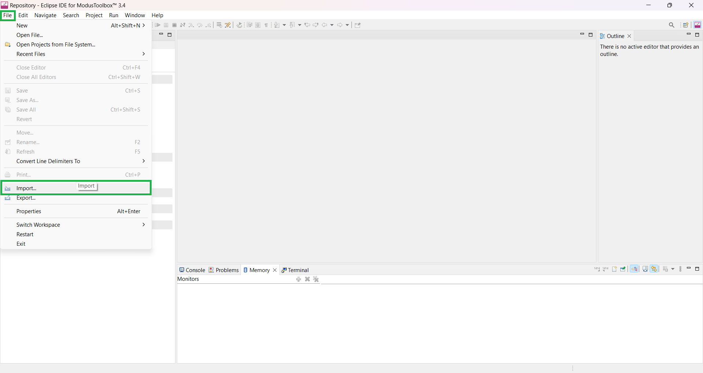
    </picture>
     
    &nbsp;
</li>
<li> Select 'ModusToolbox™' – 'Import Existing Application In-Place' and press 'Next'.   
    <picture>
        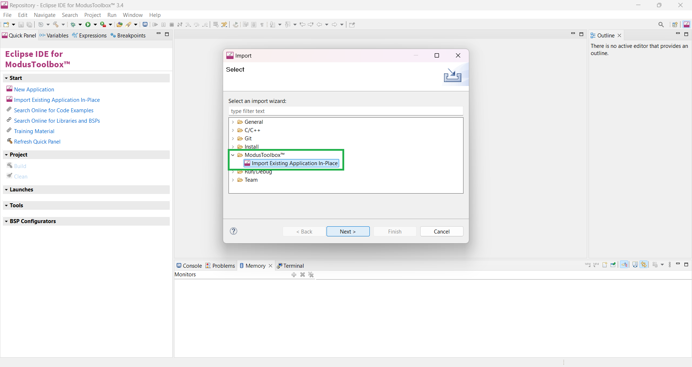
    </picture>
     
    &nbsp;
</li>
<li> Find the Project Location by pressing 'Browse…'.   
    <picture>
        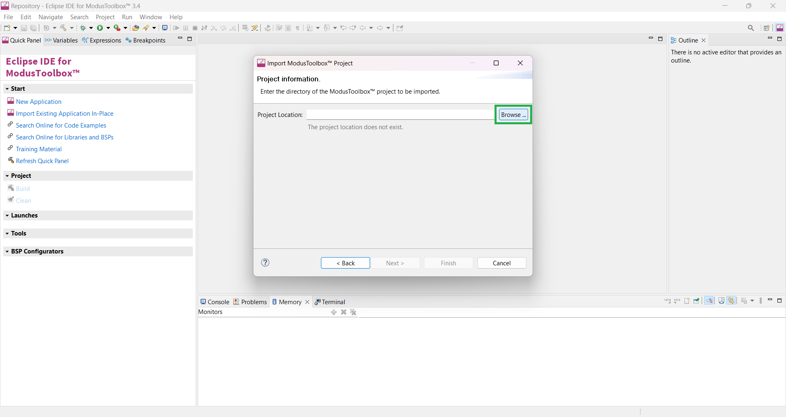
    </picture>
     
    &nbsp;
</li>
<li> Select the project folder accordingly and press 'Finish'.   
    <picture>
        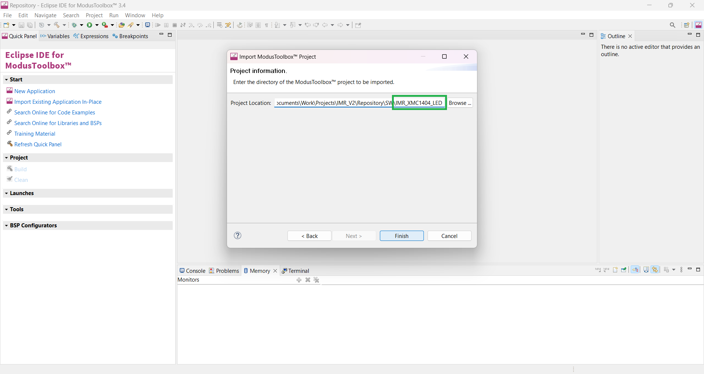
    </picture>
     
    &nbsp;
</li>
<li> Wait until the project is fully imported.   
    <picture>
        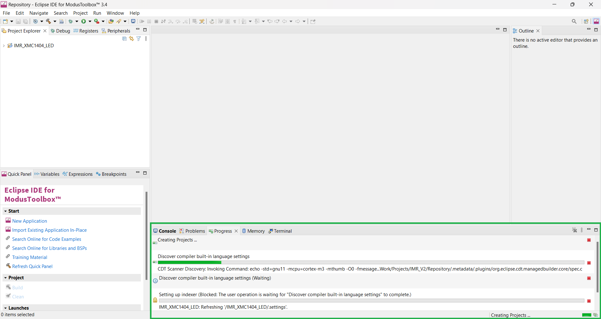
    </picture>
     
    &nbsp;
</li>
<li> Notice that additional folder 'mtb_shared' should be created (if there was none) when the import is completed.   
    <picture>
        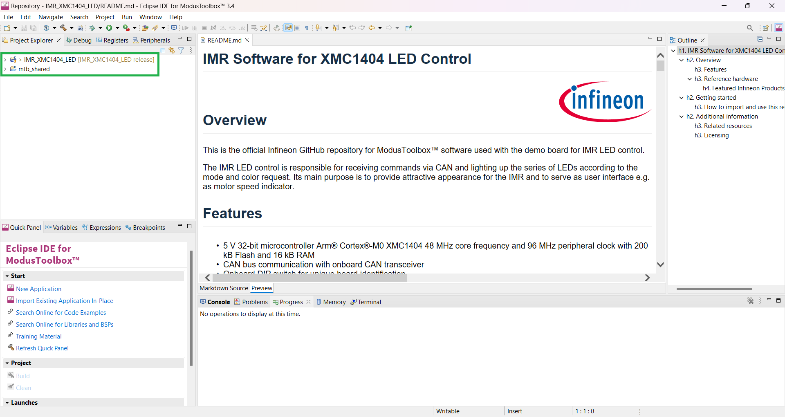
    </picture>
     
    &nbsp;
</li>
<li> Right click the project folder and select 'ModusToolbox™' followed by 'Library Manager 2...'.   
    <picture>
        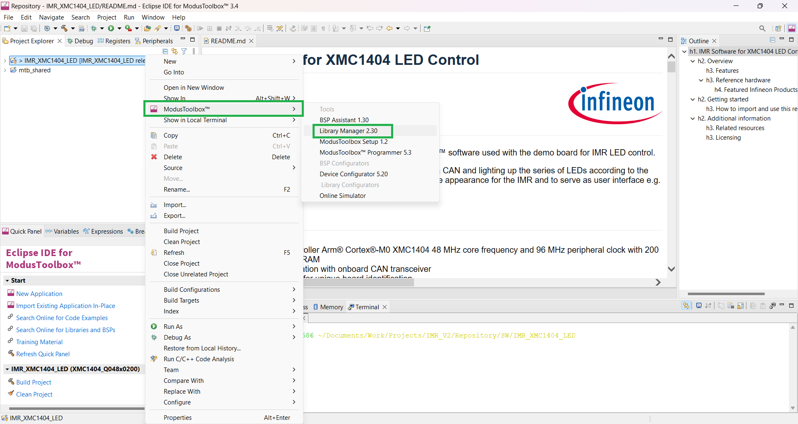
    </picture>
     
    &nbsp;
</li>
<li> Press the 'Update' button   
    <picture>
        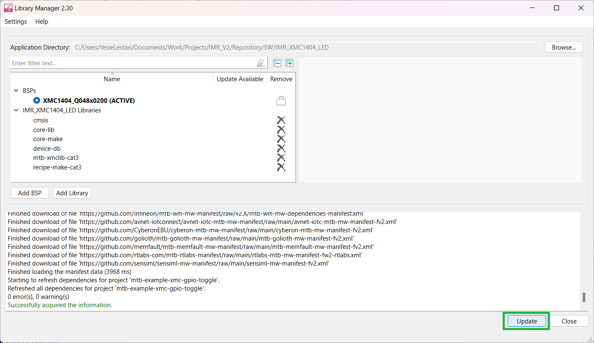
    </picture>
     
    &nbsp;
</li>
<li> When the Update is completed the sucessful messages should be displayed. If the update failed, try it again by repressing the 'Update' button. If this also fails try to clean the project, before trying it again.   
    <picture>
        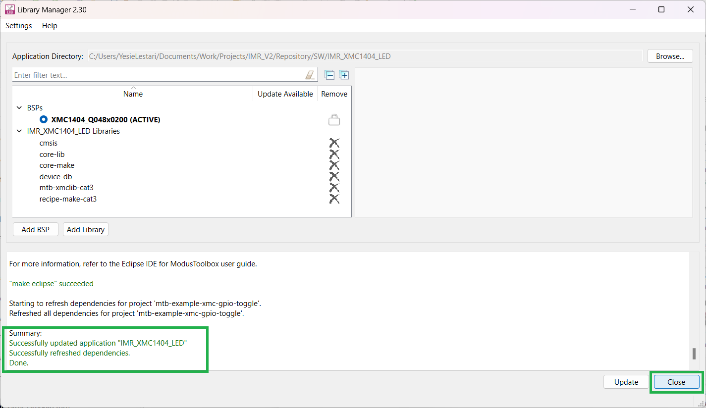
    </picture>
     
    &nbsp;
</li>
<li> Before building the project it is recommended to clean it by pressing 'Clean Application'.   
    <picture>
        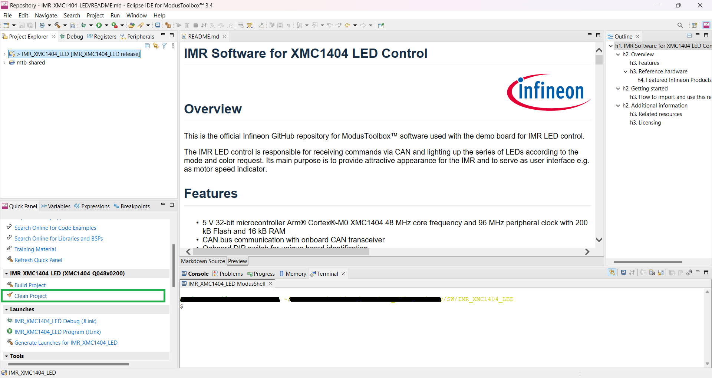
    </picture>
     
    &nbsp;
</li>
<li> Finally the project can be compiled by pressing 'Build Application'.   
    <picture>
        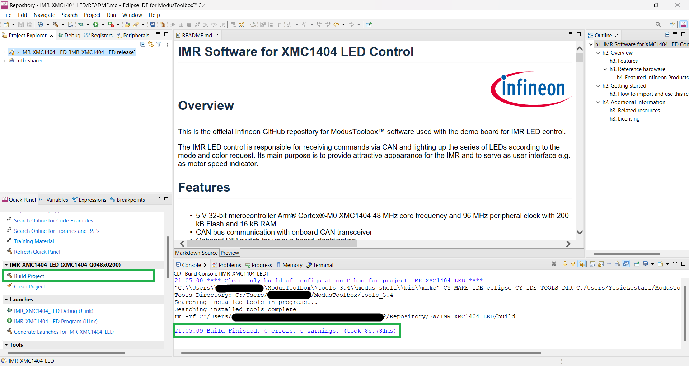
    </picture>
     
    &nbsp;
</li>
<li> Before flashing the project onto the board, connect the XMC™ Link Programming adapter using the 10-pin flat cable and <a href="./assets/DEMO_IMR_PROGADPTR_V1@e7eacb3013a-zip">the programming adapter</a> to provide power to the board. If the programming adapter is not available, connect external power supply to the 5V and GND pins of the green / P1 connector onboard.   
	<picture>
        
    </picture>
     
	<picture>
        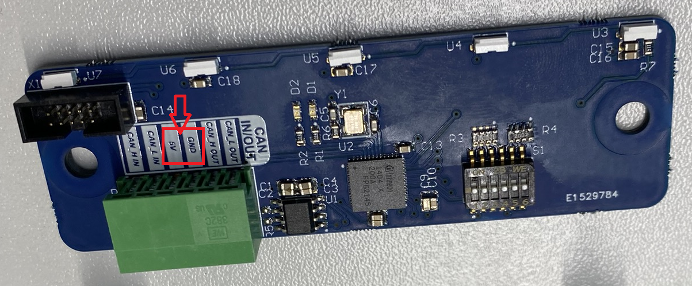
    </picture>
     
    &nbsp;
</li>
<li> Finally to flash the project onto the board, use the green play button in ModusToolbox™ on the bottom left - 'Quick Panel' - 'Launches' - 'IMR_XMC1404_LED Program (JLink)' to initiate the process.  
	<picture>
        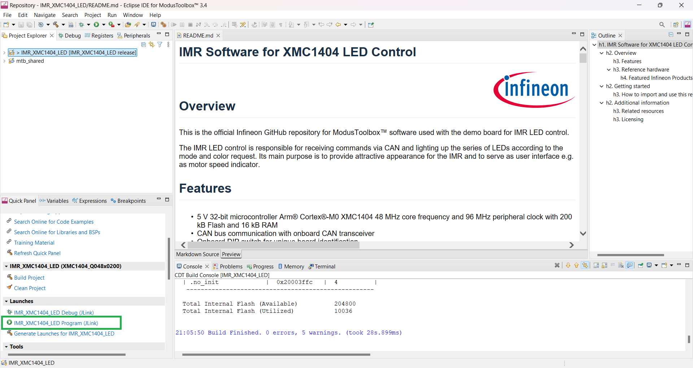
    </picture>
     
    &nbsp;
</li>
</ol>

## Additional information

Precise definition of the software and its features can be found in the close-to-code documentation on top of each file, at the specific function itself and in the software documentation.

### Related resources

- [Robotics development platform: Infineon Mobile Robot (IMR)](https://www.infineon.com/cms/de/applications/robotics/development-platform/)
- [IMR main control](https://www.infineon.com/cms/en/product/evaluation-boards/demo_imr_mainctrl_v1/)
- [IMR motor control](https://www.infineon.com/cms/en/product/evaluation-boards/demo_imr_mtrctrl_v1/)

### Licensing

Please see our [LICENSE](LICENSE) for copyright and license information.
